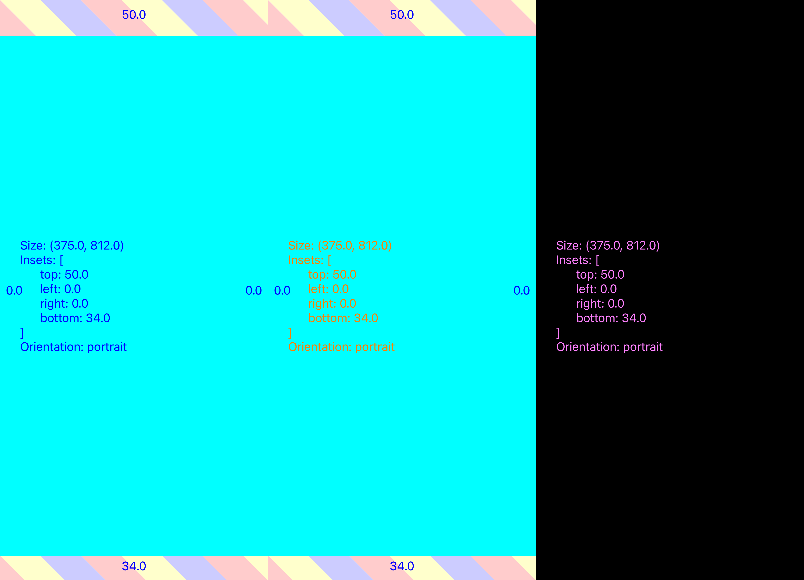

# SDSnapshots library sample project

This project features demo setup for iOS products Snapshot Testing with [SDSnapshots package](https://github.com/salute-developers/snapshots-kit-ios).


- [SDSnapshots library sample project](#sdsnapshots-library-sample-project)
  - [Stack](#stack)
  - [Repo content](#repo-content)
  - [Run tests](#run-tests)
    - [Prepare](#prepare)
    - [Run](#run)
  - [Read tests results](#read-tests-results)
  - [Store .png better (use Git LFS)](#store-png-better-use-git-lfs)
  - [License](#license)

## Stack

- **Xcode** 16.1
- **iOS Simulator Runtime** 18.1 (iPhone 16 simulator)
- **Swift** 6.0

Different tools versions may cause test failures due to UIKit render updates.

*In this case test run in .record mode is needed to capture fresh reference images.*

## Repo content

- `SampleProj.xcodeproj` with **SDSnapshots package** integration and 2 targets:
  - SDSnapshotTests – test target with library usage samples
  - HostApp – iOS app serving as `TEST_HOST` for SDSnapshotTests

## Run tests

### Prepare

- install required Xcode version
- install required iOS Simulator Runtime version
- create simulator with required device model and runtime
- tune simulator device preferences for accessibility and locale

Simulator language preference, keyboards and accessibility toggles should be set as needed.

We are not currently ship automated device setup script. But you can reference our fastlane fragment with `simctl` gem usage:

```ruby
def self.set_test_device_preferences(device)
  keyboards = [
    "ru_RU@sw=Russian;hw=Automatic",
    "en_US@sw=QWERTY;hw=Automatic",
    "emoji@sw=Emoji",
  ]

  plist = {
    AppleLanguagesDidMigrate: "20E247",
    AppleLanguagesSchemaVersion: 3000,
    AKLastIDMSEnvironment: 0,
    AKLastLocale: "ru_RU",
    AppleLocale: "ru_RU",
    AppleLanguages: ["ru-RU", "en-US"],
    AppleKeyboards: keyboards,
    ApplePasscodeKeyboards: keyboards,
    PKLogNotificationServiceResponsesKey: false,
    AddingEmojiKeybordHandled: true,
    AccessibilityEnabled: true,
    ApplicationAccessibilityEnabled: true,
  }
  File.write(device.path.global_preferences_plist, Plist::Emit.dump(plist))
end
```

This settings can be set filled in Settings.app UI on device. 

Or from Terminal:

```sh
xcrun simctl list devices -j
```

- grab "dataPath" from `simctl` output
- add `/Library/Preferences/.GlobalPreferences.plist` to this path
- save setting plist to located file

### Run

- clone the repository
- open *SampleProj.xcodeproj*
- select *HostApp* scheme
- select *iPhone 16* simulator device with *iOS 18.1* runtime
- run tests (cmd+U)

✅ If environment setup is valid, all tests should be green.

## Read tests results

❌ In case of test case failure, read assert provided description and check workdir for created `merge.png` images to see comparison details.

Some `merge.png` failures examples are listed below.

🔎 *Text color has changed*



🔎 *Text string has changed*


🔎 *Accessibility label has gone missing*


## Store .png better (use Git LFS)

Git LFS usage is strongly advised in your own test project. It converts relatively large `.png` files to lightweight text "pointers".

Read [more about git LFS here](https://docs.github.com/en/repositories/working-with-files/managing-large-files/about-git-large-file-storage). Check if this feature is provided by your remote git service.

This sample repository configuration is not optimal. We put `.png` files in commits only because it is free of charge option on the Github.

Brief LFS setup steps:

- [install git-lfs utility](https://docs.github.com/en/repositories/working-with-files/managing-large-files/installing-git-large-file-storage) (basically single binary at PATH is needed)
- create `.gitattributes` file with filetypes map to LFS

```sh
# .gitattributes in the repo root

# Assets
*.png filter=lfs diff=lfs merge=lfs -text
```

- `git lfs install` to setup hooks
- `git add your_reference.png` should now store images in LFS
- `git lfs status` to check whether `Git:` or `LFS:` pointer used
- Now you are able to commit and push your pictures using LFS

## License

Project is under [MIT License](LICENSE).
